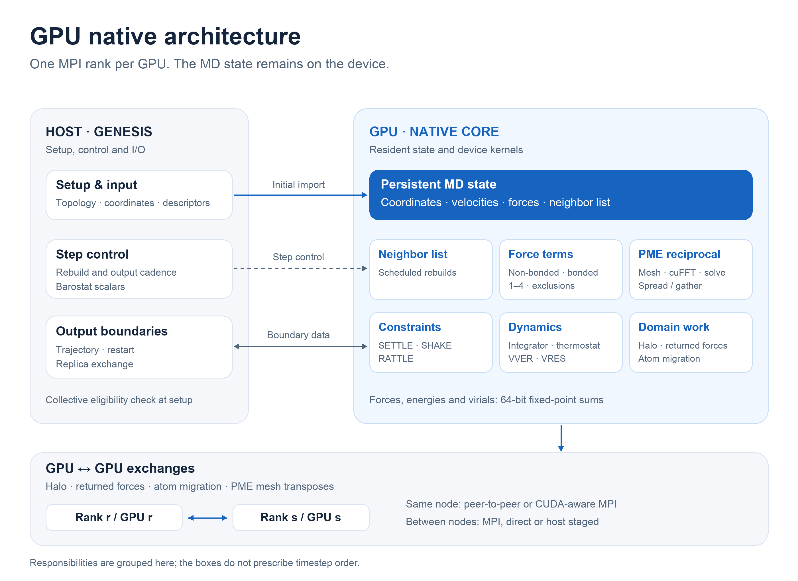

# GENESIS SPDYN. Now GPU-resident.

[Quick start](#quick-start) · [User guide](doc/21_GPU_Native.rst) · [Architecture](doc/21_GPU_Native.rst#architecture-at-a-glance) · [Example output](doc/21_GPU_Native.rst#example-output) · [Release & benchmarks](https://github.com/wmarti/genesis-native/releases/tag/gpu-resident-v1)

<picture>
  <source media="(prefers-color-scheme: dark)" srcset="https://github.com/wmarti/genesis-native/releases/download/gpu-resident-v1/hero-dark.png">
  
</picture>

The entire molecular dynamics step now runs on the GPU. Coordinates, forces, the pair list, PME, constraints and the
integrator stay on the device from one output step to the next. The host steps in only to read input, write output and
make a handful of scalar decisions.

Enable it with `gpu_resident = YES`. Every rank makes the same eligibility decision, and rank 0 logs the result.
Unsupported simulations fall back together to the standard path; native-only modes stop with the logged reason.

## Quick start

**For GENESIS users:** keep your SPDYN system and input files, build this branch, and enable the native core in `[DYNAMICS]`.
**For GROMACS users:** run a GENESIS `.inp` control file with supported topology and coordinate inputs.
See the [input-file guide](doc/03_Input.rst) for the GROAMBER formats; choose precision at runtime as shown below.

### 1. Build

You need an NVIDIA GPU and CUDA toolkit (including `nvcc` and cuFFT), compatible C/C++ and Fortran compilers,
MPI with C and Fortran support, BLAS/LAPACK, GNU Make, Autoconf and Automake.
On a cluster, load the site's compiler, MPI and CUDA modules first.

```bash
git clone --recurse-submodules https://github.com/wmarti/genesis-native.git
cd genesis-native
autoreconf -i
./configure --enable-gpu --enable-double --with-gpuarch=sm_80 \
  --prefix="$PWD" CC=mpicc FC=mpif90
make -j4
make install
```

`sm_80` is an example target; replace it with your GPU's CUDA architecture.
If CUDA is outside the compiler's search paths, add `--with-cuda=/path/to/cuda` to `configure`.
The executable is `bin/spdyn`. Keep `--enable-double` for **both** native precision modes;
select Mixed in the simulation input, using the same binary.
See [installation and library options](doc/01_Getting_Started.rst) for site-specific compiler and BLAS/LAPACK settings.

### 2. Enable it in your existing input

Add this keyword to your input's existing `[DYNAMICS]` section:

```ini
[DYNAMICS]
gpu_resident = YES
```

The default is full double precision. For Mixed precision with PME, add this to the existing `[ENERGY]` section:

```ini
[ENERGY]
nonbond_precision = MIXED
```

These snippets extend a complete GENESIS input file; the system, topology, coordinates, force field and ensemble
still come from your simulation setup. Check the [supported simulations](doc/21_GPU_Native.rst#supported-simulations)
before selecting the native core.

### 3. Run with one MPI rank per GPU

From the directory containing your simulation input and its data files:

```bash
mpirun -np 1 /absolute/path/to/genesis-native/bin/spdyn md.inp > md.log
```

Replace the binary path and `md.inp` with your own paths. For four allocated GPUs use four MPI ranks;
follow your scheduler's placement and GPU-binding rules so each rank drives a distinct GPU.

### 4. Confirm the native core is active

Rank 0 prints the decision in the log:

```text
Setup_GPU_Core> requested=YES effective=native precision=FP64 reason=eligible
```

Mixed runs report `precision=mixed`. `effective=cpu` means the core declined the input and selected the
standard path; read `reason` and the [fallback rules](doc/21_GPU_Native.rst#fallback).
Native-only modes, including Mixed precision, stop with the reason when the native core cannot run.

[Read actual B200 timing and Blackwell FP64 output](doc/21_GPU_Native.rst#example-output), with an explanation of timing, energy hashes and precision checks.

[Full native GPU guide](doc/21_GPU_Native.rst) · [Architecture diagram and explanation](doc/21_GPU_Native.rst#architecture-at-a-glance) · [All input keywords](doc/21_GPU_Native.rst#keywords)

## Fast. Measurably.

<picture>
  <source media="(prefers-color-scheme: dark)" srcset="https://github.com/wmarti/genesis-native/releases/download/gpu-resident-v1/stock-dark.png">
  
</picture>

Same inputs, same GPUs. Against upstream GENESIS 2.1.6 at its best rank and thread settings, this release is
**15× to 25× faster in Mixed precision** and **2× to 11× faster in FP64**.

## Built to scale.

<picture>
  <source media="(prefers-color-scheme: dark)" srcset="https://github.com/wmarti/genesis-native/releases/download/gpu-resident-v1/scaling-dark.png">
  
</picture>

A million atoms of satellite tobacco mosaic virus, from 51 ns/day on one B200 to 147 ns/day on four. On STMV, every GPU
model we tested gets faster with each GPU added, from the RTX 3090 to the B200. The smaller Cellulose system scales less
on PCIe hosts; the full notes have every number.

## Clear about where it stands.

<picture>
  <source media="(prefers-color-scheme: dark)" srcset="https://github.com/wmarti/genesis-native/releases/download/gpu-resident-v1/gromacs-dark.png">
  
</picture>

On B200, STMV runs within 5% of NVIDIA's published GROMACS 2025.3 figures. On RTX PRO 6000 Blackwell it is 14 to 31%
behind, and Cellulose is 1.8 to 2.5× behind on both. Published figures come from other hosts with unpublished settings,
so read them as orientation, not as a head-to-head. GROMACS itself was not run.

## Two precisions. One binary.

**Mixed (FP32, like GROMACS).** Pair, bonded and 1-4 terms, the PME mesh and water constraints in single precision; the
pair list, 64-bit fixed-point accumulation and integration in double. Graded against fine-table FP64 references with
upstream's own `tolerance_single`: the largest deviation is 1.2e-5 (van der Waals), 1.8e-6 on total energy.

**FP64 (full double).** Bitwise reproducible. Across a 16-case ensemble matrix, NVE to NPT, r-RESPA and T-REMD, on 1 to 4
ranks, two runs gave bitwise identical output in all 46 legs, on two GPU architectures.

## Everything stays on the GPU.

[](doc/21_GPU_Native.rst#architecture-at-a-glance)

[Explore the architecture in the native GPU guide →](doc/21_GPU_Native.rst#architecture-at-a-glance)

Forces, energies and virials are summed in 64-bit fixed point, so results never depend on thread scheduling. GPUs on a
node exchange halos peer to peer; nodes use MPI. The exchange path follows a fixed rule from the hardware topology,
with a single start-up probe to choose how bytes travel between two linked GPUs, never which bytes.

## Works with what you already run.

- CHARMM (PME or cutoff), AMBER and GROAMBER (PME)
- Velocity Verlet and r-RESPA; NVE, NVT, NPT, NPAT and NPgT
- SHAKE, RATTLE and SETTLE; positional and local restraints
- Temperature replica exchange; hydrogen mass repartitioning
- One GPU per rank, on one node or many

## Built for upstream.

Eight focused commits on GENESIS 2.1.6.1. LGPL-3.0, autotools, configured through input keywords only, and the binary
reads no environment variables. The mixed-precision non-bonded kernel follows the published GROMACS GPU design
(Páll and Hess, *CPC* 184, 2641, 2013; Páll et al., *J. Chem. Phys.* 153, 134110, 2020), with credit in its header.

## Still to come.

- 8 GPUs and H100 on this build, and multi-node runs beyond a single two-node test.
- Closing the gap to GROMACS, starting with Cellulose.
- Triclinic boxes, LJ-PME and the other settings that today fall back to the standard path.

<details>
<summary><b>Release v1 technical notes</b>: every table, method, gate and caveat</summary>

These measurements and commit references describe the published [`gpu-resident-v1` release](https://github.com/wmarti/genesis-native/releases/tag/gpu-resident-v1).


Based on GENESIS v2.1.6.1 (025e9eba). Branch `mainline-final`, 8 commits, tip 218b65ff (timings and tests below ran on the source tree of 29292944; the later changes are documentation fixes).
Numbers below were measured on that tip (or on a build with an identical source tree, labelled where used). Measured 2026-10-02 to 2026-10-04.

### 1. What it is

A device-resident MD step for SPDYN in the GPU build. Coordinates, velocities, forces, the pair list, bonded terms, the PME
reciprocal sum, constraints, integrator and thermostat stay on the GPU between output steps. GENESIS's own setup, input,
output and the barostat scalars stay on the host. One MPI rank drives one GPU; ranks on a node exchange halos peer to
peer or through CUDA-aware MPI, and nodes use MPI.

It is opt-in (`gpu_resident = YES`, default NO). If a run is outside the supported span, all ranks fall back together to the
existing GPU path of the same binary, and rank 0 logs the reason in one `Setup_GPU_Core>` line.

Supported: CHARMM (PME or CUTOFF), AMBER and GROAMBER (PME) force fields; VVER and VRES (r-RESPA, NVE/NVT); NVE, NVT and NPT/NPAT/NPgT (MTK barostat);
SHAKE/RATTLE, SETTLE; positional and local bond/angle restraints; temperature REMD; one GPU per rank, one or more nodes.
Other settings (other force fields, LJ-PME, FEP, GaMD, RPATH, TMD/SMD, TIP4P, Langevin barostat, triclinic boxes) run on the
standard path. Details: `doc/21_GPU_Native.rst`.

### 2. Build and enable

```
./configure --enable-gpu --enable-double --with-gpuarch=sm_80 CC=mpicc FC=mpif90
```

`--with-gpuarch` takes the target architecture; nvcc `--generate-code` options may follow it to build one binary for several
architectures. The native core needs the double-precision build (`--enable-double`, the default). `--enable-gpu-profile` adds
per-kernel event timing. The binary reads no environment variable. Regression tests:
`tests/regression_test/test_gpu_native.py "mpirun -np 2 /path/to/spdyn"`.

Keywords (all SPDYN, GPU build):

| keyword | section | values | default | meaning |
|---|---|---|---|---|
| `gpu_resident` | DYNAMICS | YES / NO | NO | run the dynamics on the native core |
| `gpu_step_graph` | DYNAMICS | YES / NO | NO | replay each plain multi-rank step as one CUDA graph (bitwise identical to NO) |
| `gpu_list_guard` | DYNAMICS | YES / NO | NO | let a pair list live up to `nbupdate_period` steps, cut short on large displacement; not with r-RESPA or NPT |
| `gpu_route_mesh` | DYNAMICS | MPI / THREAD | MPI | inter-node transport of the PME mesh transposes |
| `gpu_route_coord` | DYNAMICS | MPI / THREAD | MPI | inter-node transport of the coordinate halo |
| `gpu_route_force` | DYNAMICS | MPI / THREAD | MPI | inter-node transport of the force halo |
| `nonbond_precision` | ENERGY | DOUBLE / MIXED | DOUBLE | arithmetic of the PME non-bonded terms; MIXED needs `gpu_resident = YES` and PME |
| `ewald_evaluation` | ENERGY | TABLE / ANALYTIC | ANALYTIC where the closed form applies, else TABLE | MIXED only: lookup table or closed form with a polynomial erfc |
| `pme_grid` | ENERGY | INPUT / ACCURACY | INPUT | use the given mesh, or the smallest mesh/alpha that keeps the input's estimated force error |
| `domain_select` | BOUNDARY | STOCK / HALO | HALO (GPU build), STOCK otherwise | domain grid rule when `domain_x/y/z` are 0 |

Precision labels: "FP64 (full double)" is `nonbond_precision = DOUBLE` (bitwise reproducible for a given rank count).
"Mixed (FP32, like GROMACS)" is `MIXED`: pair term, bonded, 1-4, exclusions, PME mesh and water constraints in single
precision; pair list, accumulation (64-bit fixed point) and integration in double.

### 3. Performance

Method: `ms/step` is the steady slope of the INFO rows from one third of the run to the last row before the end. Median of
6 legs per cell (3 repetitions of two arms running the same binary, interleaved). Decks:
- STMV (1,066,628 atoms), 2 fs, PME 160^3, cutoff 12 A with CHARMM switch, NVT Bussi. **g92 deck**: list 13.5 A rebuilt every
  10 steps, 300 K, tau 5 ps, thermostat every step. **Tuned deck** (matched to the published GROMACS STMV input, Zenodo pme_nvt):
  CHARMM force switch, 298 K, tau 0.1 ps with coupling every 10 steps, list 14.5 A every 20 steps, PME mesh from `pme_grid = ACCURACY`.
  The settings NVIDIA used for its published STMV figure are not published, so neither deck is known to match it; both are shown.
- Cellulose (408,609 atoms, AMBER, HMR topology): 4 fs, 9 A cutoff, list 10.5 A every 10 steps, `pme_grid = ACCURACY`, NVT Bussi, thermostat every
  10 steps (the same family as the tuned STMV deck). Its ns/day is at 4 fs; compare ms/step.
GPU placement: each run used GPUs 0-3 of a 4-GPU allocation (same GPUs for every row of a node). RTX PRO 6000 Blackwell, RTX 4090 and
RTX 3090: all four on one socket; the 3090 has two NVLink pairs; ranks are placed two per socket. A100: GPUs 0,1 are an NVLink pair on
socket 0, GPUs 2,3 are on socket 1, so the 4-GPU A100 rows are cross-socket (1 and 2 GPU rows are same-socket). ns/day in brackets.
Every cell passed the harness audit (native engaged, full energy series) and all legs of a cell gave one energy hash. All rows with deck, build and
placement: the `timing-gpu-resident-v1.tsv` release asset.

#### Mixed (FP32, like GROMACS), ms/step (ns/day), final tip

STMV on the g92 deck and Cellulose:

| GPU | STMV 1 GPU | 2 GPUs | 4 GPUs | Cellulose 1 GPU | 2 GPUs | 4 GPUs |
|---|---|---|---|---|---|---|
| RTX PRO 6000 Blackwell, PCIe | 3.247 (53) | 2.129 (81) | 1.892 (91) | 1.074 (322) | 0.969 (356) | 1.079 (320) |
| RTX 4090, PCIe | 4.467 (39) | 3.184 (54) | 2.964 (58) | 1.528 (226) | 1.529 (226) | 1.787 (193) |
| RTX 3090, NVLink pairs | 9.569 (18) | 5.818 (30) | 3.840 (45) | 3.177 (109) | 2.125 (163) | 2.062 (168) |
| A100 80GB PCIe, NVLink pairs | 8.181 (21) | 4.876 (35) | 3.068 (56) | 2.445 (141) | 1.706 (202) | 1.506 (229) |

STMV on the tuned deck (same GPUs, same binary):

| GPU | 1 GPU | 2 GPUs | 4 GPUs |
|---|---|---|---|
| RTX PRO 6000 Blackwell, PCIe | 2.977 (58) | 1.828 (95) | 1.365 (127) |
| RTX 4090, PCIe | 4.118 (42) | 2.775 (62) | 2.170 (80) |
| RTX 3090, NVLink pairs | 8.837 (20) | 5.118 (34) | 3.230 (53) |
| A100 80GB PCIe, NVLink pairs (4 GPUs cross-socket) | 7.486 (23) | 4.299 (40) | 2.659 (65) |

The deck, not the GPUs, explains why an earlier RTX PRO 6000 STMV run gave 2.983 / 1.364 (1 / 4 GPUs) and the g92 deck gives
3.247 / 1.892 here: the same four GPUs and the same binary on the tuned deck give 2.977 / 1.365 today. The g92 deck
rebuilds its list every 10 steps and thermostats every step. A same-day A/B of two builds with this tree on the g92 deck was flat (-0.07% / +0.22%).
Two RTX 3090 nodes (2 GPUs each, 4 GPUs, STMV g92 deck, Mixed, earlier build with the same source tree): 5.850 ms/step.

#### FP64 (full double), ms/step (ns/day), final tip

| GPU | STMV 1 GPU | 2 GPUs | 4 GPUs | Cellulose 1 GPU | 2 GPUs | 4 GPUs |
|---|---|---|---|---|---|---|
| RTX PRO 6000 Blackwell, PCIe | 53.97 (3.2) | 28.01 (6.2) | 14.50 (11.9) | 12.46 (27.7) | 6.761 (51) | 3.590 (96) |
| RTX 4090, PCIe | 70.32 (2.5) | 36.10 (4.8) | 18.27 (9.5) | 15.88 (21.8) | 8.526 (40) | 4.417 (78) |
| RTX 3090, NVLink pairs | 142.04 (1.2) | 73.17 (2.4) | 36.98 (4.7) | 31.75 (10.9) | 17.01 (20.3) | 8.709 (40) |
| A100 80GB PCIe, NVLink pairs | 19.05 (9.1) | 11.23 (15.4) | 6.255 (28) | 5.152 (67) | 3.321 (104) | 2.131 (162) |

#### Against stock GENESIS 2.1.6

Stock is upstream 2.1.6 built with its own `--enable-gpu` (same configure, one precision per binary), run on RTX PRO 6000
Blackwell x4, ranks per GPU and threads swept for the best value (Mixed: 32 cores; FP64: 20 cores). Same inputs for both, stock-compatible decks
(`pairlistdist` 14.5 with a 20-step list for STMV, native-only keywords removed); these decks differ slightly from the ones above, so the
native values differ slightly too. Stock's GPU path is CPU-bound and flat in GPU count. Stock Mixed values are from a
full-node run on 2026-10-01; stock FP64 and all native values were measured on 2026-10-03.

| system, precision | 1 GPU native / stock ms/step | 2 GPUs | 4 GPUs |
|---|---|---|---|
| STMV, Mixed | 2.994 / 45.47 = 15.2x | 1.835 / 40.68 = 22.2x | 1.737 / 40.63 = 23.4x |
| Cellulose, Mixed | 1.079 / 27.14 = 25.2x | 1.250 / 23.55 = 18.8x | 1.472 / 22.88 = 15.5x |
| STMV, FP64 | 58.00 / 123.6 = 2.1x | 30.72 / 73.60 = 2.4x | 15.43 / 62.99 = 4.1x |
| Cellulose, FP64 | 12.27 / 39.81 = 3.2x | 6.668 / 39.95 = 6.0x | 3.516 / 38.37 = 10.9x |

Stock was not measured on the other GPU models, on B200, or on more than one node.

#### B200, final tip

Mixed, ms/step (ns/day), DGX B200 (NVSwitch), GPUs 0-3 of a 4-GPU allocation, measured 2026-10-04 with the same method
and binary as the tables above (median of 6 interleaved legs, 3000 steps; every cell passed the audit with one energy hash).
8 GPUs could not be allocated on the final tip (one GPU of the node was in use by another job).

| system, deck | 1 GPU | 2 GPUs | 4 GPUs |
|---|---|---|---|
| STMV, tuned deck | 3.364 (51) | 2.022 (85) | 1.175 (147) |
| STMV, g92 deck | 3.646 (47) | 2.285 (76) | 1.388 (124) |
| Cellulose | 1.221 (283) | 0.974 (355) | 0.853 (405) |

An earlier integration build (`int-final`, aa299b98, plus one scheduling change; mean of 3, 3000 steps, 2026-10-01) gave
STMV (tuned deck) 3.362 / 2.034 / 1.164 / 0.840 at 1 / 2 / 4 / 8 GPUs, within 1% of the final tip where both were run. Its
Cellulose row (1.147 / 0.883 / 0.765 / 0.750) used a different Cellulose deck (harness PME grids), so it is not comparable
with the final-tip Cellulose row; the 8-GPU values are from that build only.

#### Published GROMACS numbers, for orientation only

These are other people's runs on other machines, not a same-machine comparison. Source: NVIDIA HPC Application Performance
page (GROMACS 2025.3), read 2026-09-29; the host, mdrun options, input and, for Cellulose, the time step are not
published. ms/step is derived from the published ns/day assuming 2 fs (corroborated for STMV, not for Cellulose; at
4 fs the Cellulose figures would double). Full list with sources: the `gromacs_published.csv` release asset.

| system | hardware (published) | 1 GPU | 2 GPUs | 4 GPUs | 8 GPUs |
|---|---|---|---|---|---|
| STMV | RTX PRO 6000 Blackwell SE | - | 1.600 | 1.041 | 1.035 |
| STMV | H100 SXM | - | 2.304 | 1.329 | 0.886 |
| STMV | B200 | - | 1.942 | 1.115 | 0.700 |
| Cellulose | RTX PRO 6000 Blackwell SE | - | 0.525 | 0.435 | 0.454 |
| Cellulose | B200 | - | 0.525 | 0.336 | 0.289 |
| STMV | A100 (GROMACS 2024.1, NHR@FAU, 1 GPU) | 7.448 | - | - | - |
| STMV | A100 (GROMACS 2023, 4 per node, NVIDIA blog, read off a figure) | - | - | 2.743 | - |

Comparison with our numbers (tuned STMV deck, the one matched to the published GROMACS input; Cellulose as above):
- RTX PRO 6000 Blackwell (same GPU model, different host): STMV 1.600 / 1.041 published against our 1.828 / 1.365 at 2 / 4 GPUs;
  Cellulose 0.525 / 0.435 against our 0.969 / 1.079. Published GROMACS is faster in all four cells.
- B200 (final tip, tuned STMV deck): STMV at 2 / 4 GPUs, 1.942 / 1.115 published against our 2.022 / 1.175 (4% and 5%
  slower); at 8 GPUs 0.700 against 0.840 from the earlier build. Cellulose at 2 / 4, 0.525 / 0.336 against our 0.974 / 0.853.
  Published is faster in every cell.
- A100: STMV 1 GPU 7.486 against 7.448 (GROMACS 2024.1, A100 variant not stated): equal within 0.5%. STMV 4 GPUs 2.659 against
  2.743 (GROMACS 2023, 4 A100 per node, read off a figure): ours is 3% lower, on different hosts and an older GROMACS release. This
  is the only matching-class row where ours is not slower. Our 4-GPU A100 run is cross-socket PCIe/NVLink-pair hardware.
- On the g92 deck our STMV numbers are higher (Mixed table above); that deck rebuilds its list twice as often and thermostats every step.
- No published GROMACS row exists for RTX 4090 or RTX 3090. The nearest class, L40S, is a different GPU; we did not compare it.
H100 was not measured on the final tip. GROMACS itself was not run.

### 4. Correctness

All of the following ran on the final source (29292944; the tip 218b65ff differs only in doc/21_GPU_Native.rst) unless stated.

- **56-case regression suite** (the GENESIS suite with the native cases added, checked build, RTX 4090 and RTX 3090
  nodes, 1 and 2 ranks; 4 ranks not run on the final tip). Both nodes gave identical counts. FP64 (`suite`):
  56/56 pass at 1 rank and at 2 ranks; native engaged in 43 cases at 1 rank and 41 at 2 ranks, 8 and 10 fell back
  to the standard path (with the logged reason), 5 have no GPU hook. Mixed (`suitemixed`): 0 failed; 48/56 (1 rank) and
  46/56 (2 ranks) completed, the other 8/10 cases decline the native core (restraint types, TMD/SMD, harmonic impropers, an
  import refusal for two 2-rank cases) and stop, because MIXED exists only in the native core.
- **FP64 determinism, 16-case ensemble matrix**: NVE, NVT (Bussi, Berendsen, NHC, Bussi with period 1), NPT (Bussi
  isotropic, Bussi isotropic period 1, Berendsen, NHC, semi-isotropic, anisotropic), NPAT, NPgT, VRES NVT and NPT, and
  T-REMD (4 replicas). 1, 2 and 4 ranks (REMD 4 ranks): 46 legs, native engaged in every one. Two runs of the same build
  are bitwise identical in all 46 legs on an RTX PRO 6000 Blackwell and an RTX 4090 node. The previous tip (9d462f2c) against the final source (one kernel's read of
  unused mask words fixed, no effect on results): 46/46 bitwise equal on both nodes.
- **Hydrogen mass repartitioning** (`hydrogen_mr = YES`): the native core uses the repartitioned masses. STMV, FP64, 1 rank, 100 steps: native and standard-path
  energies agree to 1e-10 relative at all 10 output steps, and differ strongly from the same run without it. The Cellulose deck uses an HMR topology; an earlier build's native FP64 first-output energy matched stock FP64 to 1e-7 relative.
  No suite case covers it (only GaMD cases use the keyword); Mixed and multi-rank were not checked.
- **Re-baselined FP64 reference**: after merging the VV and r-RESPA paths, GCC's `-O3 -ffast-math` inlining rounds the
  host barostat 1 ulp differently, so the 9 barostat cases are no longer bitwise against the previous integration build;
  the reference is now this series (the device code is unchanged).
- **Mixed against upstream tolerance**: Mixed runs are graded against FP64 fine-table references (`table_density`
  2000) with upstream's `tolerance_single` = 3.0e-5 (relative). In the suite's per-term comparison the largest deviations
  were 1.2e-5 (van der Waals term) and 1.8e-6 (total energy).
- T-REMD (4 replicas, 5000 steps) and NPT STMV (12000 steps, 1 and 4 ranks) ran on the previous tip: T-REMD output is bitwise
  identical to the earlier build; NPT means agree within spread. Not rerun on the final tip.
- Not run: the suite at 4 ranks; `compute-sanitizer` on the final tip; multi-node correctness beyond one 2-node timing run
  (energies identical across its 45 legs).

### 5. Design notes

- **Architecture.** A Fortran bridge converts GENESIS's arrays to plain C descriptors (`gpu_core_abi.h`, mirrored in
  `sp_gpu_core_abi.fpp`); the device owns one slot per owned atom, grouped by rigid group and sorted by cell. Particle data
  reaches the host only at output, restart and replica-exchange boundaries. The host decides list rebuilds, output and
  barostat scalars; the device does the rest. Forces, energies and virials are summed in 64-bit fixed point, so results do
  not depend on thread scheduling. Eligibility is one collective decision at setup.
- **Fused or host-driven exchange** is a fixed topology rule: host-driven when every peer link of the run is PCIe and some
  GPU exchanges with two or more peers, fused into the step's stream otherwise. Both paths move the same bytes into the
  same slots.
- **One timing-based choice**: for an edge between two GPUs with a peer link, the peer or staged path (pinned host staging,
  peer copy engines, peer SM stores) is chosen from the start-up probe. It changes how bytes move, never which bytes. The
  chosen routes are printed with each plan.
- **Mixed-precision non-bonded kernel.** The cluster-pair kernel (`gpu_nbcluster.cu`) follows the GROMACS GPU non-bonded design
  as published: 8-atom clusters, j clusters in groups of four with an interaction mask, exclusions as bitmasks, a dual
  list with in-kernel pruning, and the force reduction. GROMACS is Copyright the GROMACS development team and licensed under
  LGPL-2.1-or-later; the file is distributed under LGPL-3.0 as the rest of GENESIS and says so in its header. The design is
  described in S. Pall and B. Hess, Comput. Phys. Commun. 184, 2641 (2013), and S. Pall et al., J. Chem. Phys. 153, 134110
  (2020). Per-cell recursive-bisection clusters, fixed-point sums, the FP32 erfc polynomial and the list pruning folded into
  the force pass are GENESIS's own.

### 6. Limitations and known gaps

- Not validated on the final tip: H100 (no result on this series), B200 at 8 GPUs (earlier build only), more than one node beyond a
  single 2-node run, 4-rank suite, REMD and NPT workloads (see Correctness).
- Inter-node THREAD against MPI transport: not measured cleanly (the one comparison shared the network with another run);
  default is MPI.
- Speed against published GROMACS: slower in every matching-hardware comparison above.
- Open items, one line each:
  - host-free pair-list rebuild (bounded at about 40 us/step on B200 at 4 GPUs), not started;
  - longer Cellulose list lifetimes gain 7-12% on RTX 3090 but need a missed-pair certificate first;
  - single-phase halo, fused kick passes and a PME-stream priority change: built or gated on some nodes, not landed;
  - two timed transport choices (SM stores versus copy engines, placement sweeps) could become fixed rules given B200 probe data;
  - no keyword forces the peer/staged choice over the start-up probe;
  - `--enable-mixed` is not wired to `nonbond_precision`; the mirrored Fortran/C ABI structs could be folded;
  - the rebuild/domain/migration code (about 11.8k lines) could be redesigned to about 6.5k;
  - published ADH dodec cannot run (triclinic box); published-baseline qualification is partial (time steps unknown for Cellulose).

### 7. Commits (`mainline-final`, on 025e9eba)

| commit | subject |
|---|---|
| 03908ef1 | [SPDYN] Fixes found while porting spdyn to the GPU |
| d10c67ff | [BUILD] Link cuFFT and detect the MPI and CUDA include paths |
| 312f5f9a | [SPDYN] GPU native core: state, nonbonded, bonded and constraint kernels |
| d8db85fe | [SPDYN] GPU native core: PME reciprocal sum |
| 603512eb | [SPDYN] GPU native core: domains, migration and transport |
| 924134d4 | [SPDYN] Dispatch MD to the GPU native core, with a logged fallback |
| 2a7947d5 | [TEST] GPU native regression cases and fine-table references |
| 218b65ff | [DOC] GPU native user guide and developer notes |

101 files, +48,803/-212 lines against v2.1.6.1.

</details>
